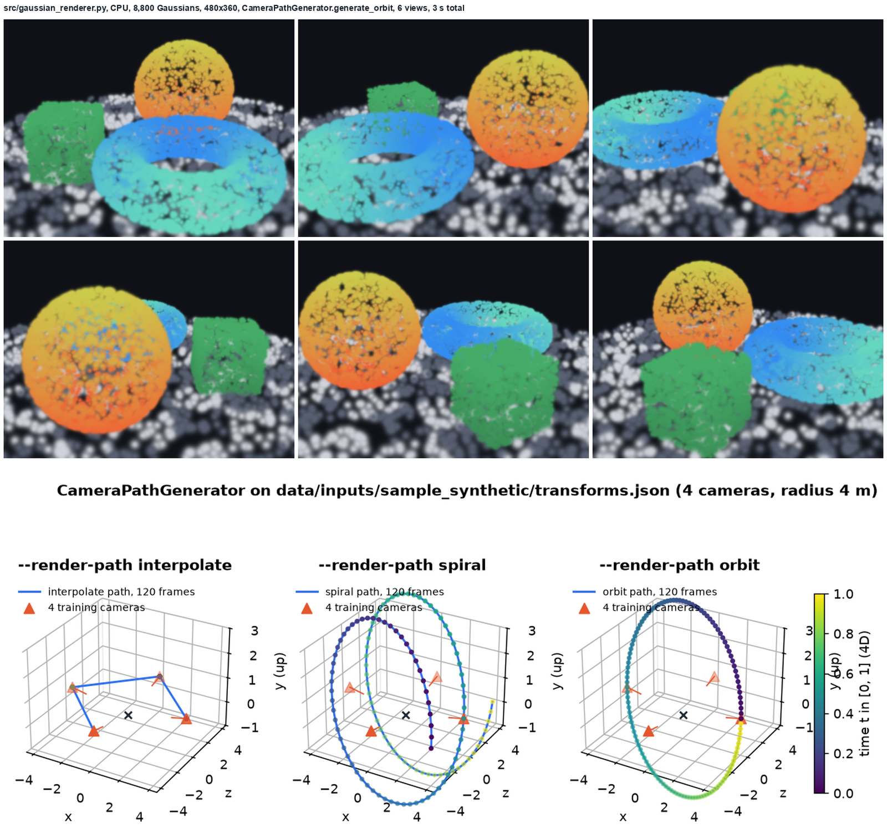
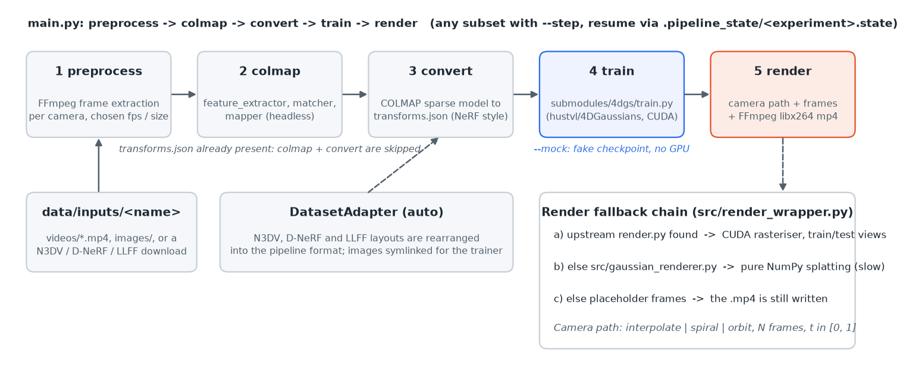
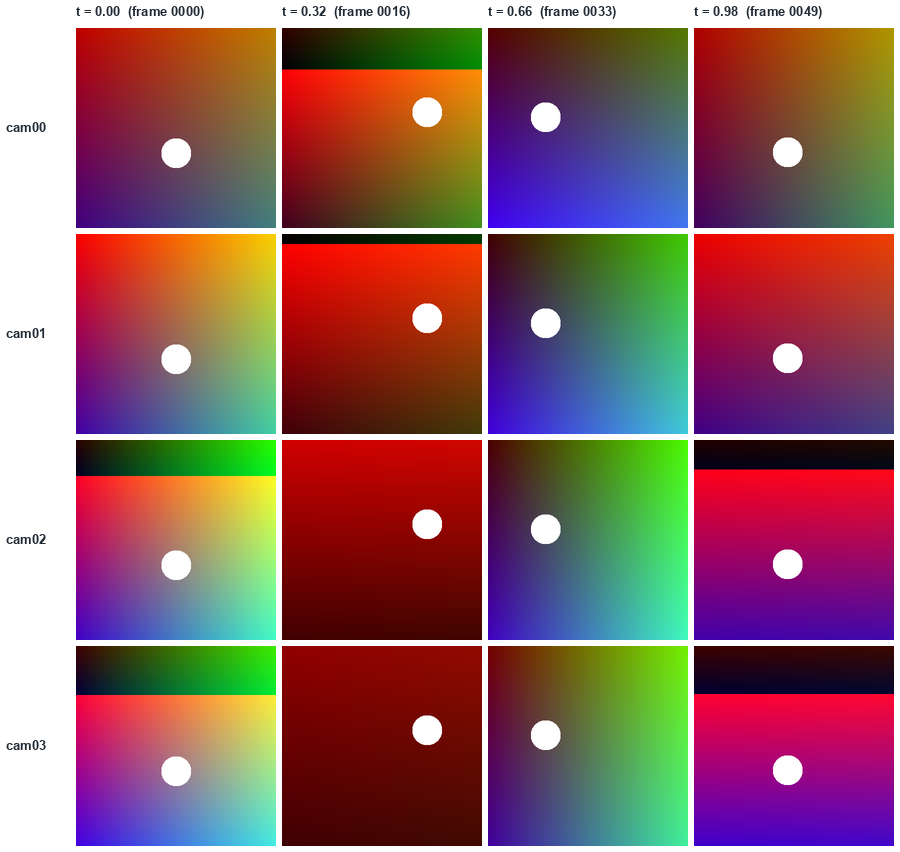
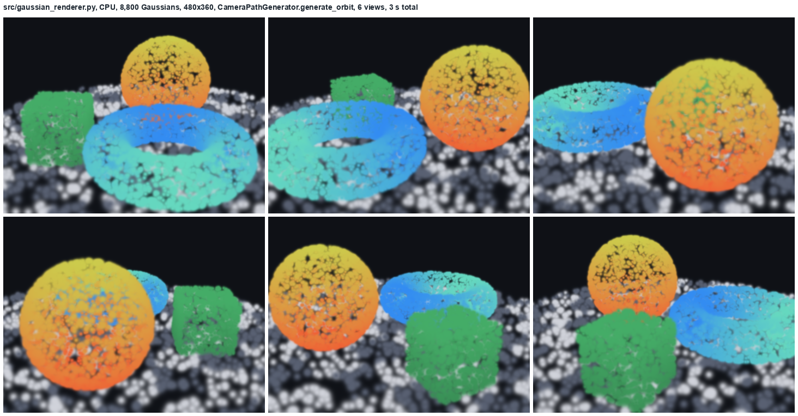
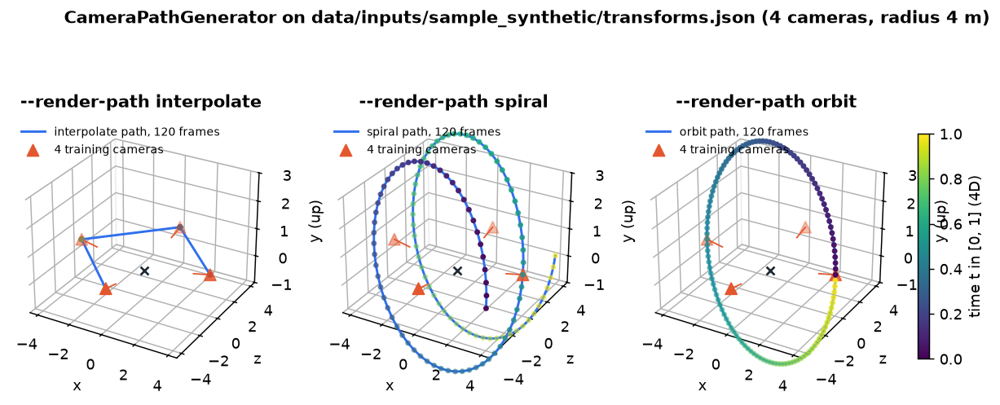

<h1 align="center">4DGS Pipeline</h1>

<p align="center">
  
  
  
  
  
  
</p>

<p align="center">
  <strong>Multi-view video in, a trained 4D Gaussian Splatting model and a rendered fly-through out.</strong><br/>
  One command runs frame extraction, COLMAP pose estimation, conversion to <code>transforms.json</code>,<br/>
  training with <a href="https://github.com/hustvl/4DGaussians">hustvl/4DGaussians</a> and rendering along an interpolated, spiral or orbit camera path,<br/>
  with per-step resume, YAML configs, a RunPod setup script and a pure-NumPy renderer that works without CUDA.
</p>

<h3 align="center"><a href="#getting-started"><ins>Getting started</ins></a></h3>

<p align="center">
  
</p>

<p align="center">
  <sub>Top: <code>src/gaussian_renderer.py</code> rendering 8,800 Gaussians on a laptop CPU along a path from <code>CameraPathGenerator.generate_orbit</code> (about 0.5 s per 480x360 frame). The scene is a hand-built 3DGS checkpoint (a sphere, a torus, a cube and a ground disc written in the same PLY layout the trainer saves), not a trained model. Bottom: the <code>interpolate</code>, <code>spiral</code> and <code>orbit</code> paths built from the four cameras in <code>data/inputs/sample_synthetic/transforms.json</code>.</sub>
</p>

## Features

<table>
<tr>
<td width="50%" valign="middle">

### Five steps, one CLI

`main.py` runs `preprocess → colmap → convert → train → render`. Pick any subset with `--step`, resume a failed run with `run_pipeline.sh --resume` (state is kept in `.pipeline_state/<experiment>.state`), or force everything again with `--no-skip`.

If a valid `transforms.json` already exists, COLMAP and conversion are skipped automatically. `--mock` fakes a checkpoint so the whole chain can be exercised without a GPU.

</td>
<td width="50%">
  
</td>
</tr>
<tr>
<td width="50%" valign="middle">

### Frame extraction and sample data

`src/preprocess.py` probes each video with FFmpeg, extracts synchronized frames at a chosen `fps`, format and optional resize, and writes them per camera.

`download_sample_data.sh` fetches N3DV `coffee` / `flame_salmon` or D-NeRF `lego`, or generates `sample_synthetic`: 4 cameras on a 4 m circle, 50 time steps each, with a white disc moving over a gradient that changes colour with time.

</td>
<td width="50%">
  
</td>
</tr>
<tr>
<td width="50%" valign="middle">

### Rendering with a fallback chain

`src/render_wrapper.py` builds a camera path, calls the upstream `render.py` when present, otherwise uses the pure NumPy `src/gaussian_renderer.py` (projected Gaussians with soft falloff, back-to-front alpha compositing, SH DC colour), and as a last resort writes placeholder frames so the video step still completes. Frames are encoded with FFmpeg (`libx264`, `crf 18`).

The native renderer is slow and approximate (each splat is a Python loop iteration and is drawn isotropic), but it is what makes a GPU-free dry run produce a picture.

</td>
<td width="50%">
  
</td>
</tr>
<tr>
<td width="50%" valign="middle">

### Three camera paths, plus time

`CameraPathGenerator` reads the training poses from `transforms.json` and produces `interpolate` (between the training cameras, looped), `spiral` (around the mean camera position, sweeping the height range) or `orbit` (one circle at fixed height). Every frame also carries a normalized time `t` in `[0, 1]`, which is what makes the render a 4D fly-through rather than a static turntable.

</td>
<td width="50%">
  
</td>
</tr>
</table>

**Also in the box**

- **Headless COLMAP.** `src/colmap_wrapper.py` drives feature extraction, exhaustive or sequential matching and sparse reconstruction from Python, with GPU on or off, and `src/convert_colmap.py` turns the binary or text model into NeRF-style `transforms.json` (intrinsics, per-image 4x4 poses). This converter is what the unit tests cover.
- **Public dataset adapters.** `DatasetAdapter` detects N3DV, D-NeRF and LLFF layouts and rearranges them into the pipeline format before preprocessing.
- **Training delegated to the upstream code.** `src/train_wrapper.py` locates `submodules/4dgs/train.py` (hustvl/4DGaussians, pinned as a git submodule), runs it with the configured iterations, save and test iterations and resolution, streams the log to `training.log`, verifies the checkpoint and saves `cfg_args` next to it so rendering can find the source path.
- **Interactive 4D viewer.** `src/viewer_4d.py` (pygame) walks the trained model in space and time: WASD/QE and mouse to move, arrow keys and space to scrub and play the timeline, `1`-`9` to jump. `./view_4d.sh <experiment>` launches it.
- `setup_runpod.sh` installs system packages, FFmpeg and COLMAP, picks a PyTorch build matching the container's CUDA (12.1 / 11.8 / 11.7 / 11.6), installs the requirements, initialises the submodule and builds its `depth-diff-gaussian-rasterization` and `simple-knn` CUDA extensions.
- `monitor_training.sh` and `check_status.sh` for watching a run from a second terminal; `--compress` to tar the outputs for download from a cloud box.
- `RENDER_GUIDE.md` (Korean) on rendering options and fetching results from RunPod; `GIT_PUSH_GUIDE.md` (Korean) on pushing from the container.

---

## How it works

```text
data/inputs/<dataset>/videos/*.mp4  (or images/, or a dataset with poses)
        │
        ▼  preprocess   FFmpeg frame extraction  ──▶ data/processed/<exp>/images/
        ▼  colmap       feature_extractor → matcher → mapper   (skipped if transforms.json exists)
        ▼  convert      COLMAP sparse model ──▶ data/outputs/<exp>/transforms.json
        ▼  train        submodules/4dgs/train.py -s <source> -m <model> --iterations N
        │               ──▶ data/outputs/<exp>/model/point_cloud/iteration_N/point_cloud.ply
        ▼  render       camera path (interpolate | spiral | orbit)
                        ──▶ upstream render.py  ▷ native NumPy renderer  ▷ placeholder frames
                        ──▶ FFmpeg ──▶ data/outputs/<exp>/renders/*.mp4
```

1. **Configure.** `PipelineConfig` (`src/config.py`) merges defaults, an optional `--config` YAML (see `configs/`) and CLI flags. `skip_existing: true` makes every step idempotent.
2. **Adapt and preprocess.** Public datasets are reshaped first; videos are split into frames per camera folder.
3. **Poses.** COLMAP runs with the configured camera model (`OPENCV` by default) and matcher; the result is converted to `transforms.json`, and images are symlinked to where the trainer expects them.
4. **Train.** The wrapper checks the checkpoint exists and saves `cfg_args` alongside so rendering can find the source path and iteration.
5. **Render and encode.** The latest `iteration_*` is picked automatically; `--render-frames` controls length. Poses follow the NeRF / OpenGL convention (camera looks down `-z`, `+y` up), and the native renderer projects with that convention.

<details>
<summary><strong>Output layout</strong></summary>

```text
data/outputs/<experiment>/
├── transforms.json
├── model/
│   ├── point_cloud/iteration_30000/point_cloud.ply
│   ├── cfg_args
│   └── training.log
└── renders/
    ├── frames/
    └── render_interpolate.mp4
```

</details>

---

## What has actually been run

Everything below was run on an Apple Silicon Mac with no CUDA, Python 3.12 and `numpy<2`, from a clean clone. It is the basis for the images in this README.

| Command | Result |
| --- | --- |
| `pytest tests/` | 21 passed in 0.3 s (config defaults, COLMAP-to-`transforms.json` conversion). |
| the `sample_synthetic` generator from `download_sample_data.sh` | 200 frames (4 cameras x 50 times) and `transforms.json`. Run as plain Python because macOS ships bash 3.2, which lacks the `declare -A` the script uses; use bash 4+ on Linux. |
| `python main.py --input data/inputs/sample_synthetic --experiment mock_demo --mock --iterations 3000 --render-frames 24 --render-path orbit` | Whole chain in 0.8 s: COLMAP auto-skipped, mock checkpoint written, 24 frames rendered by the native renderer (100 splats visible per frame) and encoded to `render_orbit.mp4`. |
| `src/gaussian_renderer.py` + `CameraPathGenerator.generate_orbit` on a hand-built 8,800-Gaussian checkpoint | The six renders above, about 0.5 s per 480x360 frame. |

Not run here: COLMAP (not installed) and real training (needs the CUDA extensions). No trained model, metric or benchmark is published in this repository; the renders above are of a synthetic checkpoint, not of a scene learned from images.

Two bugs were found and fixed while doing this:

- `main.py`: the training progress callback used an invalid f-string (`{progress.loss:.4f if ...}`) and raised `ValueError` at the first progress report, so `--mock` (and any real run with a loss value) crashed before rendering.
- `src/gaussian_renderer.py`: `Camera.project_point` treated `+z` as "in front of the camera", but every pose the pipeline produces (`transforms.json`, all three camera paths) is NeRF / OpenGL style with `-z` forward. Every native render therefore reported `0 visible splats` and wrote black frames, which is consistent with the failed `sample_synthetic_test` render recorded in `.pipeline_state/`. The projection now uses `depth = -z` and flips `y`.

One remaining wrinkle: the synthetic generator in `download_sample_data.sh` writes colour values above 255 into a `uint8` image. NumPy 1.x wraps them (the green and black bands at the top of some sample frames), NumPy 2 raises `OverflowError`. `requirements.txt` already pins `numpy<2`.

---

## Tech stack

<p>
  <kbd>Python&nbsp;3</kbd> &nbsp; <kbd>PyTorch&nbsp;1.13&nbsp;–&nbsp;2.1&nbsp;(CUDA)</kbd> &nbsp; <kbd>hustvl/4DGaussians</kbd> &nbsp; <kbd>mmcv&nbsp;1.6</kbd> &nbsp; <kbd>COLMAP</kbd> &nbsp; <kbd>FFmpeg</kbd> &nbsp;
  <kbd>NumPy&nbsp;&lt;2</kbd> &nbsp; <kbd>OpenCV</kbd> &nbsp; <kbd>open3d</kbd> &nbsp; <kbd>plyfile</kbd> &nbsp; <kbd>PyYAML&nbsp;/&nbsp;OmegaConf</kbd> &nbsp; <kbd>loguru</kbd> &nbsp; <kbd>Pillow</kbd> &nbsp; <kbd>pygame</kbd> &nbsp; <kbd>pytest</kbd>
</p>

---

## Getting started

**Prerequisites**

- Linux with an NVIDIA GPU and a CUDA toolkit that matches your PyTorch build (the upstream CUDA extensions are compiled at setup). A CPU-only machine can still run the tests, the synthetic sample, `--mock` and the native renderer.
- COLMAP and FFmpeg on `PATH` (`setup_runpod.sh` installs both with apt).
- Python 3 with pip, bash 4+ for the shell scripts. NumPy must stay below 2.0.

```bash
git clone https://github.com/yc9954/4DGS.git
cd 4DGS
git submodule update --init --recursive        # pulls hustvl/4DGaussians into submodules/4dgs

# RunPod / Ubuntu container: everything in one go
chmod +x setup_runpod.sh && ./setup_runpod.sh

# Manual: install torch for your CUDA first (see the header of requirements.txt), then
pip install -r requirements.txt
cd submodules/4dgs/submodules/depth-diff-gaussian-rasterization && pip install . && cd ../simple-knn && pip install . && cd ../../../..

# CPU-only dry run (no submodule, no CUDA): just the pieces the wrapper code needs
pip install "numpy<2" pillow loguru pyyaml omegaconf opencv-python-headless scipy pytest
```

**Run**

```bash
./download_sample_data.sh sample_synthetic          # or: coffee, flame_salmon, lego, --list
./quick_start.sh sample_synthetic                    # simplest path

./run_pipeline.sh data/inputs/sample_synthetic my_experiment            # full pipeline
./run_pipeline.sh data/inputs/sample_synthetic my_experiment --resume   # continue after a failure
./run_pipeline.sh data/inputs/coffee coffee --skip_colmap --config configs/coffee.yaml

python main.py --input data/inputs/sample_synthetic --experiment my_experiment --step train --step render
python main.py --input data/inputs/sample_synthetic --experiment my_experiment --step render --render-path spiral --render-frames 300
python main.py --input data/inputs/sample_synthetic --experiment dry --mock --render-frames 24   # no GPU needed
./view_4d.sh my_experiment --time 0.5
```

Your own data goes under `data/inputs/<name>/videos/` (multi-view videos), `data/inputs/<name>/images/`, or alongside a ready `transforms.json`.

| Flag / script option | Default | What it does |
| --- | --- | --- |
| `--step` | all five | One or more of `preprocess`, `colmap`, `convert`, `train`, `render`. |
| `--config` | — | YAML overriding `configs/default.yaml`; `download_sample_data.sh` writes one per dataset. |
| `--iterations`, `--resolution` | `30000`, `-1` | Training length and input resolution (`-1` = original). |
| `--matcher`, `--no-gpu` | `exhaustive`, GPU on | COLMAP matcher (`sequential` for video) and GPU toggle. |
| `--skip_colmap`, `--adapt_dataset` | off, `auto` | Skip pose estimation; force `n3dv` / `dnerf` / `llff` / `none`. |
| `--render-path`, `--render-frames` | `interpolate`, `300` | Camera path type and length. |
| `--method`, `--method_path` | `4dgs` | Training engine (`4dgs`, `4dgaussians`, `fudan`, `custom`) and where its `train.py` lives. |
| `--mock`, `--compress`, `--no-skip`, `-v` | off | Fake training for a dry run; tar outputs; ignore existing outputs; verbose logs. |
| `run_pipeline.sh --gpu N` | `0` | Selects the CUDA device for the whole run. |

---

## Building and testing

```bash
pytest tests/            # 21 unit tests for src/config.py and src/convert_colmap.py
python main.py --input data/inputs/sample_synthetic --experiment dry --mock    # pipeline without a GPU
python -m src.gaussian_renderer data/outputs/<exp>/model --iteration 30000 -o render_output   # one native frame
```

There is no CI workflow. The tests cover configuration defaults and the COLMAP-to-`transforms.json` conversion (camera models, rotation and inversion of the 4x4 matrices); the training and rendering wrappers are exercised only by running them.

---

## Repository structure

| Path | What lives there |
| --- | --- |
| `main.py` | `Pipeline` class with the five steps, dataset adaptation, COLMAP auto-skip, CLI. |
| `src/config.py` | Dataclass configs (frame extraction, COLMAP, training, render) and YAML loading. |
| `src/preprocess.py` | FFmpeg frame extraction, `VideoInfo`, `DatasetAdapter` (N3DV, D-NeRF, LLFF). |
| `src/colmap_wrapper.py`, `src/convert_colmap.py` | Headless SfM and the `transforms.json` converter. |
| `src/train_wrapper.py` | Finds and runs the upstream `train.py`; mock mode; checkpoint verification and `cfg_args`. |
| `src/render_wrapper.py`, `src/gaussian_renderer.py` | Camera paths, upstream / native / placeholder rendering, FFmpeg encoding. |
| `src/viewer_4d.py`, `view_4d.sh` | Interactive pygame viewer. |
| `configs/` | `default.yaml`, plus generated `sample_synthetic.yaml`, `coffee.yaml`, `test_sample.yaml`. |
| `run_pipeline.sh`, `quick_start.sh`, `monitor_training.sh`, `check_status.sh` | Shell front-ends with resume, GPU selection and monitoring. |
| `setup_runpod.sh`, `download_sample_data.sh` | Environment and dataset bootstrap. |
| `submodules/4dgs` | Git submodule → `hustvl/4DGaussians` (`master`). |
| `tests/` | pytest suites. |
| `docs/` | The images in this README (`overview.png`, `native-render.png`, `camera-paths.png`, `sample-input.png`, `pipeline.png`), all produced by running this repository's code on a CPU. |
| `data/{inputs,processed,outputs}/`, `logs/`, `.pipeline_state/` | Runtime directories (git-ignored except `.gitkeep`); one recorded state file shows a `sample_synthetic_test` run that reached `render` and failed. |
| `RENDER_GUIDE.md`, `GIT_PUSH_GUIDE.md` | Korean guides for rendering / inference and for pushing from RunPod. |

---

## Project status

**Working today.** Configuration, frame extraction, headless COLMAP, `transforms.json` conversion (unit-tested), dataset adapters, sample-data download, submodule-based training with checkpoint verification, camera-path generation, the native NumPy renderer, FFmpeg encoding, resume state, `--mock` end to end, the RunPod installer and the pygame viewer. Commit history through late December 2025 records fixes found while running on RunPod (root containers without sudo, image symlinks for training, `cfg_args` saving, a rewrite of `render_wrapper.py`).

**Fallbacks to be aware of.** When the upstream `render.py` is not found the pipeline renders with the NumPy splatter, which is slow and approximate; when even that fails it writes placeholder frames and still produces an `.mp4`. Check `renders/frames/` before trusting a video. `--mock` writes a tiny 100-point fake `point_cloud.ply`.

**Known limitations.** `--method fudan` and `custom` are declared but only the hustvl layout is pinned as a submodule. The shell scripts need bash 4+ (`declare -A`). The native renderer draws every Gaussian as an isotropic disc (the 3D scale is averaged, the rotation is ignored) and ignores view-dependent SH terms. `download_sample_data.sh` overflows `uint8` when generating the synthetic scene (harmless bands on NumPy 1.x, an exception on NumPy 2). No trained results, metrics or benchmark images exist in this repository.

**Credits.** Training and the CUDA rasterizer are [hustvl/4DGaussians](https://github.com/hustvl/4DGaussians) (4D Gaussian Splatting for Real-Time Dynamic Scene Rendering). The native renderer follows Kerbl et al., 3D Gaussian Splatting (2023), and borrows the point-rendering idea from Blender's `gpu_shader_3D_point_varying_size_varying_color`. Sample datasets: [Neural 3D Video](https://github.com/facebookresearch/Neural_3D_Video) and [D-NeRF](https://github.com/albertpumarola/D-NeRF).

---

## License

No LICENSE file is committed yet, so default copyright applies: all rights reserved. The previous README stated that the project follows the license of the upstream 4DGaussians repository; the submodule keeps its own license, and that statement is preserved here for the wrapper code's intent.
